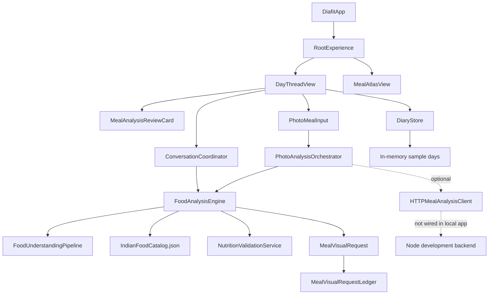

# Diafit audit findings

Status: baseline captured on 2026-07-15 before audit-branch modifications.

## Architecture map

## Retested known failures

| Scenario | Current result | Audit conclusion |
| --- | --- | --- |
| `black coffee` | Curated low-calorie record; UI asserts `470` absent | Historical defect not reproduced on current commit |
| `chai and paratha` | Two components; asks milk/sugar and paratha variation; no salad label | Unrelated artwork defect not reproduced; nutrition intentionally waits for answers |
| `sprouts with 3 boiled eggs` | Two components; eggs = 3; nonblank totals; visual-ready state | Exact regression passes |
| `whey protein shake` | First-class supplement draft with scoop/base clarification | Exact recognition regression passes |
| `three eggs with sprouts` | Sprouts incorrectly inherit `3 wholeEgg` | **Reproduced systemic component-boundary defect** |
| Immediate app launch | White screen between launch and first useful content | **Reproduced perceived-startup defect** |

## Critical findings

### F-001 — No durable diary persistence

`DiafitApp` constructs `DiaryStore(days: SampleDiary.days)` on every launch. Confirmed meals, edits and deletions live only in memory. There is no schema version, migration, atomic write, corruption recovery or deletion implementation for stored health-related history.

Impact: data loss on termination and inability to meet the product’s core diary contract.

### F-002 — Component quantities are not span-bound

`QuantityExtractor` scans six tokens preceding every entity. It does not stop at connectors or the previous entity. In `three eggs with sprouts`, the sprouts component consumes the egg quantity and unit.

Impact: nutrition can be multiplied with the wrong unit while validation still approves the component.

Resolution on audit branch: fixed with entity-neighbour scopes bounded only by connectors between detected foods. Quantity parsing now inspects the owning prefix and a unit-qualified suffix. A clean red run recorded four incorrect sibling assertions; the subsequent suite passed 31/31.

### F-003 — Preparation and modifiers are sentence-global

Preparation and modifier extractors inspect the full token array. A phrase such as `fried eggs with raw sprouts` can assign a preparation based on whichever global check is evaluated first, rather than the component’s local span.

Impact: oil assumptions, canonical variations and meal visuals can become incorrect even when entities are detected.

Partial resolution on audit branch: preparation and non-supplement modifiers now use the component token scope. Supplement bases/additions intentionally retain meal-level context because milk/water can be suppressed as standalone components. Further addition/exclusion fixtures remain required.

### F-004 — No runtime generated-image provider

The request identity and stale-response actor exist, but `MealVisualRequestLedger` documents that the app has no runtime generator. The current UI’s `MEAL VISUAL READY` state is deterministic SwiftUI artwork, not generated editorial imagery.

Impact: provider availability, retry, backgrounding, cache restoration and actual image association are not exercised by the product.

### F-005 — App opens at the conversation tail

`DayThreadView.onAppear` immediately scrolls to `tail`. On a populated day the day header and daily carbohydrate context are absent from the first settled screen.

Impact: the core daily state is hidden and repeated use feels like opening an arbitrary scroll position.

### F-006 — Visible blank launch frame

An immediate simulator capture after process launch contains only the system status/home indicators and white content. The full diary appears later.

Impact: perceived launch quality is below a premium daily-use product.

## High findings

### F-007 — Broad mutable observation

The root and every day page observe one mutable `DiaryStore`. Any published `days` mutation can invalidate the entire paged root and atlas. There is no repository, transaction or actor boundary.

### F-008 — Production and fixture behavior are adjacent

Sample diary data is the production launch source. UI-test switches and fixture photo paths are present in product modules. They are useful for deterministic tests but need an explicit debug/test configuration boundary.

### F-009 — UI test “persistence” does not cross a process boundary

The sprouts test confirms a meal and reopens its review in the same launch. The whey test only confirms and observes the saved meal. Neither terminates and relaunches after saving.

### F-010 — Atlas is a single-day modal grid

The atlas uses a blurred overlay and two-column grid for one day. Matched artwork improves continuity, but it is not the required multi-day history or genuine semantic zoom.

### F-011 — Release/privacy configuration is incomplete

No privacy manifest was found. Code signing is disabled in Debug and Release project settings. There is no account/data deletion surface, support/legal configuration, analytics/crash consent plan or TestFlight signing posture.

## Existing strengths to preserve

- Typed analysis results and draft-before-confirmation behavior.
- Curated canonical catalog and explicit nutrition provenance types.
- Central nutrition validation with category-specific safeguards.
- Structured visual identity, stable cache signatures and stale-response ledger.
- Deterministic provider-independent unit and UI tests.
- No app-bundled production provider secrets found in the baseline scan.
- Camera/photo usage descriptions are narrowly worded.

## Next evidence required

- A failing test for F-002 before the parser repair.
- Local-span tests for quantity, unit, preparation, additions and exclusions.
- Termination/relaunch persistence proof.
- Provider-unavailable image UI proof.
- Small/large phone, dark mode, Dynamic Type and Reduce Motion screenshots.
- Launch time, image decode/memory and scroll measurements.
